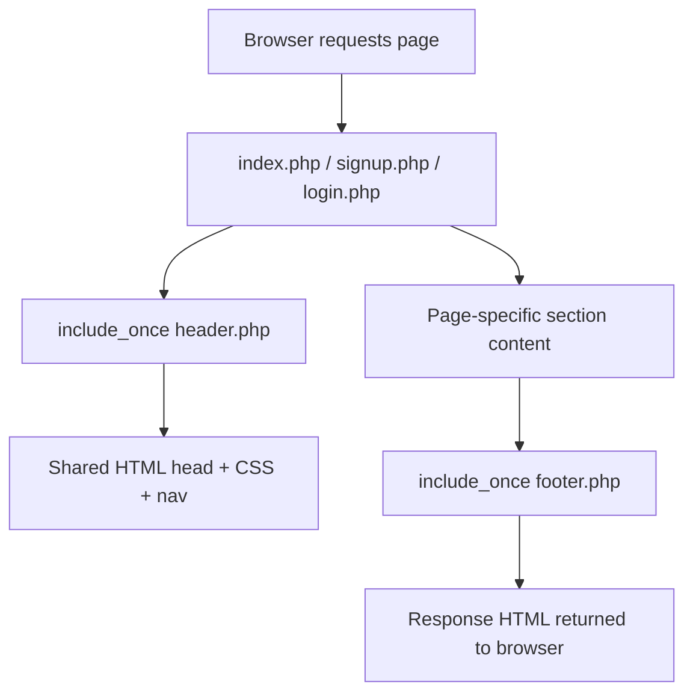
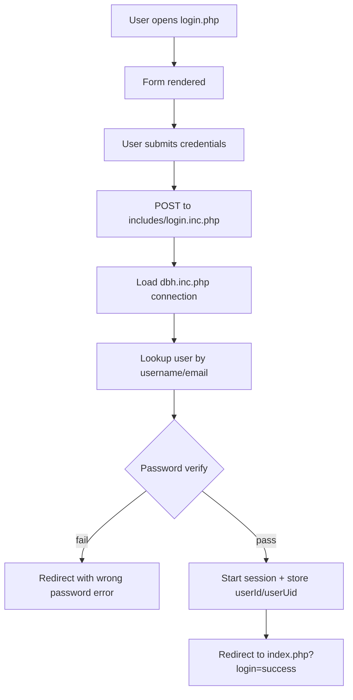
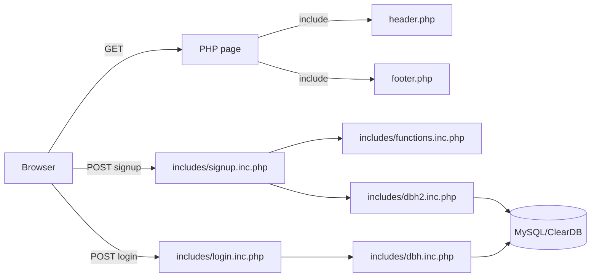

# JSX/UI Process Flow for Atom Repo

This repository is PHP-based (no React JSX files), so this flow defines the **UI-render and form-submission lifecycle** that happens in the browser layer and connects to backend handlers.

## 1) Initial page render flow



## 2) Sign-up form submission flow

```mermaid
flowchart TD
    A[User opens signup.php] --> B[Form fields rendered in signup.php]
    B --> C[User clicks SignUp]
    C --> D[POST to includes/signup.inc.php]
    D --> E[Read POST values]
    E --> F[Load dbh2.inc.php connection]
    F --> G[Load validation helpers from functions.inc.php]
    G --> H{Validation checks}
    H -- fail --> I[Redirect back to signup.php with error query]
    H -- pass --> J[createUser(...)]
    J --> K[Insert user data in DB]
    K --> L[Redirect to signup.php?error=none or success state]
```

## 3) Login form submission flow



## 4) End-to-end request map



## Notes

- `header.php` is the shared entrypoint for the visual shell (HTML head, CSS imports, navigation).
- `footer.php` closes the shared wrapper/layout.
- `signup.php` and `login.php` are the user-facing forms.
- `includes/*.inc.php` files handle server-side form processing and redirects.

If you want, I can also add a **sequence-diagram version** and a **recommended “fixed” flow** based on current validation/field mismatches.
